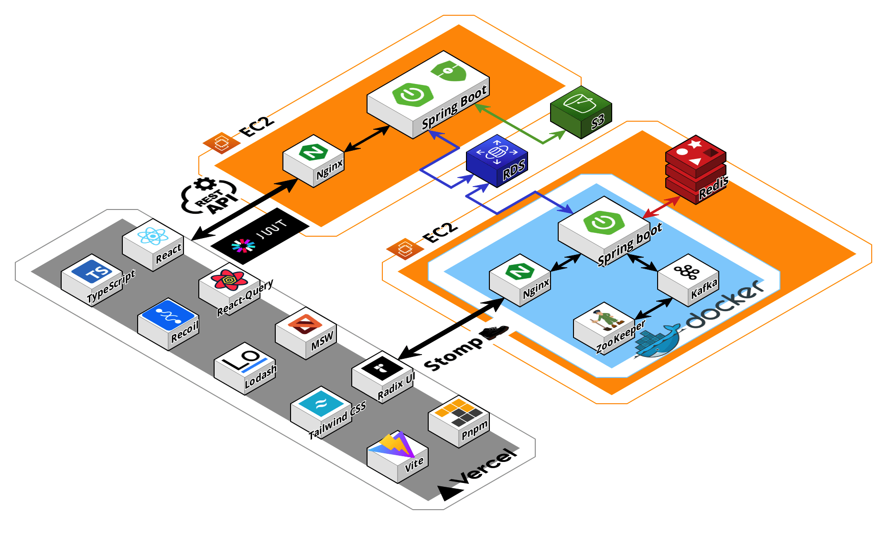

## 목차

1. [**프로젝트 소개**](#1)
2. [**기술 스택**](#2)
3. [**주요 기능**](#3)
4. [**아키텍처**](#4)
5. [**구글 애널리틱스 통계**](#5)
6. [**팀 소개**](#6)
7. [**폴더 구조**](#7)

<div id="1"></div>

## 📌 프로젝트 소개


- **소개**

  - 실시간 공동 편집이 가능한 여행/여정 공유 플랫폼, **WePlanPlans**<br/>

  - [**서비스 바로가기 Click !**](https://weplanplans.vercel.app/) 👈

- **깃허브 레포**

  - [FE Github](https://github.com/WePlanPlans/WPP_FE)
  - [BE Github](https://github.com/WePlanPlans/WPP_BE)

- **발표자료 및 영상**
  - [**PPT 바로가기 Click !**](https://drive.google.com/file/d/1TAltN9sjEYGAnMgwpinyRyZKm0VBx_8M/view?usp=sharing) 👈

<div id="2"></div>

## 📌 기술 스택

### Environment

<div style="display: flex;">
  
  
  
  
  
  
   
</div>

### FrontEnd

<div style="display: flex;">
 
  
  
  
  
  
  
   
</div>

### Others

<div style="display: flex;">
  
  
  
  
  

</div>

<div id="3"></div>

## 📌 주요 기능


<div id="4"></div>

## 📌 아키텍처



<div id="5"></div>

## 📌 구글 애널리틱스 통계

- 사용자 속성 개요

  

  

- 기술 세부정보
  

<div id="6"></div>

## 📌 팀 소개

<table>
  <tr>
    <td align="center" width="150px">
      <a href="https://github.com/seungjun222" target="_blank">
        
      </a>
    </td>
    <td align="center" width="150px">
      <a href="https://github.com/NohWookJin" target="_blank">
        
      </a>
    </td>
    <td align="center" width="150px">
      <a href="https://github.com/jseo9732" target="_blank">
        
      </a>
    </td>
    <td align="center" width="150px">
      <a href="https://github.com/joanShim" target="_blank">
        
      </a>
    </td>
    <td align="center" width="150px">
      <a href="https://github.com/suehub" target="_blank">
        
      </a>
    </td>
    <td align="center" width="150px">
      <a href="" target="_blank">
        
      </a>
    </td>
   
  </tr>
  <tr>
    <td align="center">
      <a href="https://github.com/seungjun222" target="_blank">
        어승준<br />
                팀장 (FE)
      </a>
    </td>
    <td align="center">
      <a href="https://github.com/NohWookJIn" target="_blank">
        노욱진<br />
                팀원 (FE)
      </a>
    </td>
    <td align="center">
      <a href="https://github.com/jseo9732" target="_blank">
        서지수<br />
                팀원 (FE)
      </a>
    </td>
    <td align="center">
      <a href="https://github.com/joanShim" target="_blank">
        심정아<br />
                팀원 (FE)
      </a>
    </td>
    <td align="center">
      <a href="https://github.com/suehub" target="_blank">
        이연수<br />
                팀원 (FE)
      </a>
    </td>
    <td align="center">
      <a href="https://github.com/LeHiHo" target="_blank">
        장호진<br />
                팀원 (FE)
      </a>
    </td>
  
  </tr>
</table>

|  이름  |     역할     | <div align="center">개발 내용</div>                        |
| :----: | :----------: | :--------------------------------------------------------- |
| 어승준 | FE<br />팀장 | 리뷰/댓글, 나의 리뷰, 여행취향, 공유 및 접속중 유저        |
| 노욱진 | FE<br />팀원 | 나의 관심목록, 여정 장소 조회/삭제, 우리의 관심목록        |
| 서지수 | FE<br />팀원 | 이메일/카카오 로그인/회원가입, 마이페이지, 여정 공유페이지 |
| 이연수 | FE<br />팀원 | 인기여행지, 실시간 여정 지도 및 경비 편집 (소켓)           |
| 심정아 | FE<br />팀원 | 검색페이지, 우리의 관심목록, 여정 장소 추가                |
| 장호진 | FE<br />팀원 | 모킹서버, 실시간 여정 편집(소켓)                           |

<div id="7"></div>

## 📌 폴더 구조

<details>
<summary>폴더 구조 보기</summary>

```
tenten-frontend
  ├─ .env
  ├─ .eslintrc.cjs
  ├─ .prettierrc
  ├─ custom.d.ts
  ├─ image.png
  ├─ index.html
  ├─ package.json
  ├─ pnpm-lock.yaml
  ├─ postcss.config.js
  ├─ public
  │  ├─ favicon.svg
  │  └─ vite.svg
  ├─ README.md
  ├─ src
  │  ├─ @types
  │  │  ├─ auth.types.ts
  │  │  ├─ detail.types.ts
  │  │  ├─ member.types.ts
  │  │  ├─ review.types.ts
  │  │  ├─ service.ts
  │  │  ├─ socket.types.ts
  │  │  ├─ tours.types.ts
  │  │  └─ trips.types.ts
  │  ├─ api
  │  │  ├─ auth.ts
  │  │  ├─ authClient.ts
  │  │  ├─ category.ts
  │  │  ├─ client.ts
  │  │  ├─ comments.ts
  │  │  ├─ member.ts
  │  │  ├─ region.ts
  │  │  ├─ review.ts
  │  │  ├─ socket.ts
  │  │  ├─ tours.ts
  │  │  └─ trips.ts
  │  ├─ App.tsx
  │  ├─ assets
  │  │  ├─ fonts
  │  │  │  └─ GmarketSansTTFLight.ttf
  │  │  └─ images
  │  │     ├─ CircleCheck.svg
  │  │     ├─ DeleteInput.svg
  │  │     ├─ NullUser.svg
  │  │     ├─ react.svg
  │  │     └─ Search.svg
  │  ├─ components
  │  │  ├─ Auth
  │  │  │  ├─ AuthInput
  │  │  │  │  └─ AuthInputBox
  │  │  │  │     ├─ AuthCurrentPwInputBox.tsx
  │  │  │  │     ├─ AuthEmailInputBox.tsx
  │  │  │  │     ├─ AuthInputItem
  │  │  │  │     │  ├─ AuthInput.tsx
  │  │  │  │     │  ├─ AuthInputWrapper.tsx
  │  │  │  │     │  ├─ ErrorMessage.tsx
  │  │  │  │     │  ├─ index.ts
  │  │  │  │     │  └─ ValidifyCheck.tsx
  │  │  │  │     ├─ AuthNicknameInputBox.tsx
  │  │  │  │     ├─ AuthPwCheckInputBox.tsx
  │  │  │  │     ├─ AuthPwInputBox.tsx
  │  │  │  │     └─ index.ts
  │  │  │  ├─ AuthSurvey
  │  │  │  │  ├─ AuthSurvey.tsx
  │  │  │  │  └─ AuthSurveyOption.tsx
  │  │  │  ├─ AuthTitle.tsx
  │  │  │  ├─ index.ts
  │  │  │  ├─ Login
  │  │  │  │  ├─ AuthButtons
  │  │  │  │  │  ├─ AuthButtonsWrapper.tsx
  │  │  │  │  │  ├─ KakaoLoginButton.tsx
  │  │  │  │  │  └─ SignupButton.tsx
  │  │  │  │  ├─ index.ts
  │  │  │  │  ├─ KakaoLogin.tsx
  │  │  │  │  ├─ LoginForm.tsx
  │  │  │  │  └─ LoginLogo.tsx
  │  │  │  └─ SignupInfo
  │  │  │     ├─ AuthDropDown
  │  │  │     │  ├─ AuthDropDown.tsx
  │  │  │     │  └─ AuthDropDownOption.tsx
  │  │  │     ├─ SignupInfoForm.tsx
  │  │  │     └─ UserInfoImg.tsx
  │  │  ├─ common
  │  │  │  ├─ accordion
  │  │  │  │  └─ Accordion.tsx
  │  │  │  ├─ alert
  │  │  │  │  └─ Alert.tsx
  │  │  │  ├─ BackBox
  │  │  │  │  └─ BackBox.tsx
  │  │  │  ├─ button
  │  │  │  │  ├─ Button.tsx
  │  │  │  │  ├─ ListSelectBtn.tsx
  │  │  │  │  └─ SubmitBtn.tsx
  │  │  │  ├─ header
  │  │  │  │  ├─ BackHeader.tsx
  │  │  │  │  ├─ DetailHeader.tsx
  │  │  │  │  ├─ Header.tsx
  │  │  │  │  ├─ index.tsx
  │  │  │  │  └─ ReviewHeader.tsx
  │  │  │  ├─ icons
  │  │  │  │  └─ Icons.tsx
  │  │  │  ├─ index.ts
  │  │  │  ├─ like
  │  │  │  │  └─ Like.tsx
  │  │  │  ├─ modal
  │  │  │  │  ├─ children
  │  │  │  │  │  ├─ EditDelete.tsx
  │  │  │  │  │  ├─ MyAlert.tsx
  │  │  │  │  │  └─ TripSurveyMember.tsx
  │  │  │  │  ├─ index.tsx
  │  │  │  │  └─ Modal.tsx
  │  │  │  ├─ nav
  │  │  │  │  ├─ index.tsx
  │  │  │  │  ├─ InputComment.tsx
  │  │  │  │  └─ Nav.tsx
  │  │  │  ├─ noData
  │  │  │  │  └─ NoDataMessage.tsx
  │  │  │  ├─ scrollTopButton
  │  │  │  │  └─ ScrollTopButton.tsx
  │  │  │  ├─ spinner
  │  │  │  │  └─ Spinner.tsx
  │  │  │  ├─ tab
  │  │  │  │  └─ Tab.tsx
  │  │  │  ├─ toastpopup
  │  │  │  │  └─ ToastPopUp.tsx
  │  │  │  └─ toggleGroup
  │  │  │     └─ ToggleValue.tsx
  │  │  ├─ createTrip
  │  │  │  ├─ InputField.tsx
  │  │  │  └─ SelectDate.tsx
  │  │  ├─ DatePicker
  │  │  │  └─ Calendar.tsx
  │  │  ├─ DetailSectionBottom
  │  │  │  ├─ DetailReviews.tsx
  │  │  │  ├─ DetailReviewStats.tsx
  │  │  │  ├─ DetailSectionBottom.tsx
  │  │  │  ├─ index.tsx
  │  │  │  └─ ReviewItem.tsx
  │  │  ├─ DetailSectionTop
  │  │  │  ├─ DetailAddSchedule.tsx
  │  │  │  ├─ DetailSectionTop.tsx
  │  │  │  ├─ DetailTopButton.tsx
  │  │  │  ├─ DetailToursButtons.tsx
  │  │  │  ├─ DetailToursInfo.tsx
  │  │  │  ├─ DetailToursMap.tsx
  │  │  │  ├─ DetailToursRating.tsx
  │  │  │  └─ index.tsx
  │  │  ├─ Mypage
  │  │  │  ├─ DeleteMemberButton.tsx
  │  │  │  ├─ EditPassword
  │  │  │  │  └─ EditPwForm.tsx
  │  │  │  ├─ LogoutButton.tsx
  │  │  │  ├─ MypageInfo.tsx
  │  │  │  ├─ MypageItem.tsx
  │  │  │  ├─ MypageList.tsx
  │  │  │  └─ UserInfoForm.tsx
  │  │  ├─ MyTrip
  │  │  │  ├─ CreateMyTripButton.tsx
  │  │  │  ├─ MyTrip.tsx
  │  │  │  ├─ MyTripAfterList.tsx
  │  │  │  ├─ MyTripBeforeList.tsx
  │  │  │  ├─ MyTripIngItem.tsx
  │  │  │  ├─ MyTripIngList.tsx
  │  │  │  └─ MyTripItem.tsx
  │  │  ├─ Plan
  │  │  │  ├─ PlanEditItemBox.tsx
  │  │  │  ├─ PlanItem.tsx
  │  │  │  ├─ PlanItemBox.tsx
  │  │  │  ├─ PlanMoveItem.tsx
  │  │  │  ├─ PlanSchedule.tsx
  │  │  │  ├─ PlanSectionTop.tsx
  │  │  │  ├─ TripBudget.tsx
  │  │  │  └─ TripMap.tsx
  │  │  ├─ Review
  │  │  │  ├─ CommentItem.tsx
  │  │  │  ├─ DetailReview.tsx
  │  │  │  ├─ index.tsx
  │  │  │  ├─ MyReview.tsx
  │  │  │  ├─ Review.tsx
  │  │  │  ├─ ReviewButton.tsx
  │  │  │  ├─ ReviewComments.tsx
  │  │  │  ├─ ReviewKeyword.tsx
  │  │  │  ├─ ReviewPosting.tsx
  │  │  │  └─ ReviewRating.tsx
  │  │  ├─ search
  │  │  │  ├─ RegionSelect.tsx
  │  │  │  ├─ ResultCategory.tsx
  │  │  │  ├─ ResultItem.tsx
  │  │  │  ├─ SearchInput.tsx
  │  │  │  ├─ SearchRegion.tsx
  │  │  │  ├─ SearchResult.tsx
  │  │  │  └─ StartSearchBtn.tsx
  │  │  ├─ Share
  │  │  │  ├─ CodeInput.tsx
  │  │  │  ├─ CopyBox.tsx
  │  │  │  ├─ CopyToast.tsx
  │  │  │  └─ IsEditableModal.tsx
  │  │  ├─ Tours
  │  │  │  ├─ CreateTripButton.tsx
  │  │  │  ├─ ToursCategory.tsx
  │  │  │  ├─ ToursCategoryItem.tsx
  │  │  │  ├─ ToursCategoryItemSkeleton.tsx
  │  │  │  ├─ ToursItem.tsx
  │  │  │  ├─ ToursItemSkeleton.tsx
  │  │  │  ├─ ToursList.tsx
  │  │  │  └─ ToursSectionTop.tsx
  │  │  ├─ Trip
  │  │  │  ├─ EditCodeModal.tsx
  │  │  │  ├─ LikedToursList.tsx
  │  │  │  ├─ LikedToursLists
  │  │  │  │  ├─ LikedToursListBox.tsx
  │  │  │  │  ├─ LikedToursListCategory.tsx
  │  │  │  │  ├─ LikedToursListCategoryItem.tsx
  │  │  │  │  └─ LikedToursListItem.tsx
  │  │  │  ├─ PlanTripButton.tsx
  │  │  │  ├─ TripInfo.tsx
  │  │  │  ├─ TripParticipant.tsx
  │  │  │  ├─ TripPreference.tsx
  │  │  │  ├─ TripRealtimeMember.tsx
  │  │  │  ├─ TripSchedule.tsx
  │  │  │  └─ TripSectionTop.tsx
  │  │  └─ Wish
  │  │     ├─ Wish.tsx
  │  │     ├─ WishCategory.tsx
  │  │     ├─ WishCategoryItem.tsx
  │  │     ├─ WishItem.tsx
  │  │     └─ WishList.tsx
  │  ├─ constants.ts
  │  ├─ index.css
  │  ├─ main.tsx
  │  ├─ pages
  │  │  ├─ create
  │  │  │  └─ createTrip.page.tsx
  │  │  ├─ detail
  │  │  │  └─ detail.page.tsx
  │  │  ├─ login
  │  │  │  ├─ index.ts
  │  │  │  ├─ login.page.tsx
  │  │  │  └─ loginKakao.page.tsx
  │  │  ├─ main
  │  │  │  └─ main.page.tsx
  │  │  ├─ mypage
  │  │  │  ├─ editPassword.page.tsx
  │  │  │  ├─ editUserInfo.page.tsx
  │  │  │  ├─ editUserSurvey.page.tsx
  │  │  │  ├─ index.ts
  │  │  │  └─ mypage.page.tsx
  │  │  ├─ myPageReview
  │  │  │  └─ myPageReview.page.tsx
  │  │  ├─ myTrip
  │  │  │  └─ myTrip.page.tsx
  │  │  ├─ plan
  │  │  │  ├─ addToOurPlace
  │  │  │  │  ├─ AddtoListBtn.tsx
  │  │  │  │  ├─ MyLiked.tsx
  │  │  │  │  ├─ MyLikedList.tsx
  │  │  │  │  ├─ MyLikedListItem.tsx
  │  │  │  │  ├─ PlanAddPlace.page.tsx
  │  │  │  │  ├─ ResultCategoryPlan.tsx
  │  │  │  │  ├─ ResultItem.tsx
  │  │  │  │  └─ SearchResult.tsx
  │  │  │  ├─ AddToTripPlan
  │  │  │  │  ├─ OurLiked.tsx
  │  │  │  │  ├─ OurLikedList.tsx
  │  │  │  │  └─ OurLikedListItem.tsx
  │  │  │  ├─ planPlaceSearch.page.tsx
  │  │  │  └─ planTrip.page.tsx
  │  │  ├─ reviewComment
  │  │  │  └─ reviewComment.page.tsx
  │  │  ├─ reviewPosting
  │  │  │  └─ reviewPosting.page.tsx
  │  │  ├─ search
  │  │  │  └─ search.page.tsx
  │  │  ├─ share
  │  │  │  ├─ share.page.tsx
  │  │  │  └─ shareCode.page.tsx
  │  │  ├─ signup
  │  │  │  ├─ index.ts
  │  │  │  ├─ signup.page.tsx
  │  │  │  ├─ signupInfo.page.tsx
  │  │  │  ├─ signupSuccess.page.tsx
  │  │  │  └─ signupSurvey.page.tsx
  │  │  ├─ trip
  │  │  │  ├─ AddOurList.page.tsx
  │  │  │  ├─ trip.page.tsx
  │  │  │  └─ tripEdit.page.tsx
  │  │  └─ wishList
  │  │     └─ wishList.page.tsx
  │  ├─ recoil
  │  │  ├─ Auth.atom.ts
  │  │  ├─ listItem.ts
  │  │  ├─ modal.ts
  │  │  ├─ plan.ts
  │  │  ├─ review.ts
  │  │  ├─ socket.ts
  │  │  ├─ trip.ts
  │  │  └─ tripDate.ts
  │  ├─ router
  │  │  ├─ mainRouter.tsx
  │  │  ├─ routerLayout.tsx
  │  │  ├─ ScrollToTop.ts
  │  │  └─ socketRouter.tsx
  │  ├─ utils
  │  │  ├─ authSelectOptions.ts
  │  │  ├─ calculatePercentage.ts
  │  │  ├─ calculateTripDuration.ts
  │  │  ├─ formatDate.ts
  │  │  ├─ getColor.ts
  │  │  ├─ getStarFill.ts
  │  │  ├─ getTripIdFromUrl.ts
  │  │  ├─ localStorageFun.ts
  │  │  ├─ survey.constants.ts
  │  │  └─ utils.ts
  │  └─ vite-env.d.ts
  ├─ svg.d.ts
  ├─ tailwind.config.js
  ├─ tsconfig.json
  ├─ tsconfig.node.json
  ├─ vercel.json
  └─ vite.config.ts
```

</details>

---

### ✅ 개발 기간 : `5주 - 23.12.26 ~ 24.01.29`
